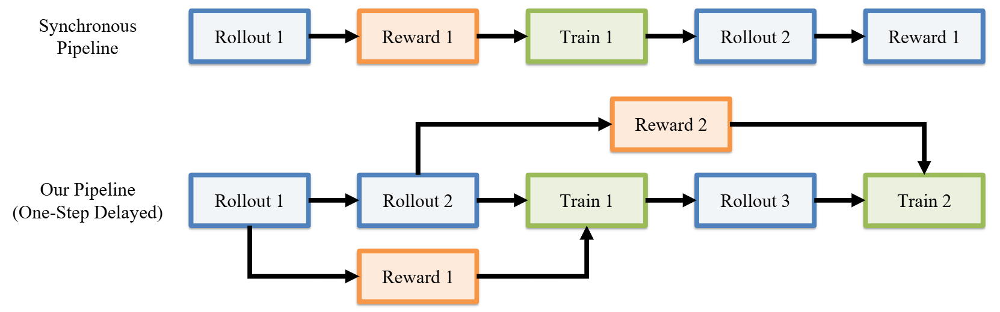

# VBVR-Pro RL training

The implementation in [`rl_training`](rl_training/) is based on the standalone
[`pufanyi/vbvr-rl`](https://github.com/pufanyi/vbvr-rl) codebase. This guide
adapts its public VBVR-Pro reinforcement-learning recipes for use from the
VBVR-Pro repository root. Prepare the isolated environment, model
initialization, public RL data, and reward runtime before starting a distributed
job. Run every command below from the repository root.

| Model | Reward and sampler | Resolution and frames | Reference topology | Config | Launcher |
| --- | --- | --- | --- | --- | --- |
| Wan2.2-TI2V-5B | VBVR rule, Flow-CPS eta 0.7 | 512 x 512 x 81 | 16 nodes x 8 GPUs (128 ranks) | `train_rl_5b_cps.yaml` | `grpo_multinode.fish` |
| Wan2.2-TI2V-5B | VBVR rule, DanceGRPO RF-SDE eta 0.3 | 512 x 512 x 81 | 16 nodes x 8 GPUs (128 ranks) | `train_rl_5b_sde.yaml` | `grpo_multinode.fish` |
| Wan2.2-TI2V-5B | Qwen3.6-27B VLM, Flow-CPS eta 0.7 | 512 x 512 x 81 | 4, 8, or 16 nodes x 8 GPUs | `train_rl_5b_vlm.yaml` | `grpo_vlm_eval_multinode.fish` |
| Wan2.2-I2V-A14B | VBVR rule, Flow-CPS with group-wise eta sampling | 256 x 256 x 161 | 1 node x 8 GPUs (TP2 x FSDP4) | `train_rl_a14b_rule.yaml` | `grpo_multinode.fish` |

These are topology-specific production references, not small examples. Review
the complete model, data, reward, and distributed contracts before launch. The
four YAML files are the complete released RL config surface.

## 1. Environment preparation

RL training uses a locked Python 3.12 and CUDA 12.6 environment under
`rl_training/.venv`. It is intentionally separate from the repository-root
Python 3.10 inference/SFT environment. Requirements include:

- Linux, NVIDIA GPUs, and a compatible CUDA driver;
- [uv](https://docs.astral.sh/uv/) 0.11.33;
- Fish for the launchers;
- FFmpeg and ffprobe on `PATH`;
- a C/C++ compiler and Python development headers for fresh Triton builds.

Create and verify the RL environment without changing the root environment:

```bash
uv --project rl_training sync --locked
uv --project rl_training lock --check
uv --project rl_training sync --locked --check
```

Check the pinned scorer and media runtime:

```bash
uv --directory rl_training run --locked python -m src.eval.vbvr_runtime
```

The production configs use the pinned Diffusers FlashAttention-3 Hub backend.
On a networked login node, populate the persistent cache once before submitting
offline jobs:

```bash
uv --directory rl_training run --locked python -m src.cli.prefetch_attention_kernel \
  --backend _flash_3_hub \
  --cache-dir ~/.cache/wan-trainer/kernels
```

The launcher uses that location by default. Set
`WAN_TRAINER_KERNELS_CACHE=/shared/path` when all nodes should use another
pre-populated cache. The cluster image must provide Python 3.12 development
headers, or `WAN_TRAINER_PYTHON_INCLUDE`/`CPATH` must point to compatible
headers before launch.

## 2. Download and prepare models, data, and rewards

Runtime artifacts live under the ignored `rl_training/storage/` tree. Create
the common directories once on storage visible at the same path from every
training node:

```bash
export RL_STORAGE="${PWD}/rl_training/storage"
mkdir -p "${RL_STORAGE}/models" \
  "${RL_STORAGE}/datasets" \
  "${RL_STORAGE}/evalkits" \
  "${RL_STORAGE}/checkpoints"
```

Paths inside the released YAML files are relative to `rl_training`, so
`storage/models/...` in a config refers to `${RL_STORAGE}/models/...`.

### 2.1 Model initialization

Download the official TI2V-5B Diffusers base when needed:

```bash
uv --directory rl_training run --locked hf download \
  Wan-AI/Wan2.2-TI2V-5B-Diffusers \
  --local-dir storage/models/Wan2.2-TI2V-5B-Diffusers
```

The three production 5B configs do **not** initialize from this clean base.
They expect a complete Diffusers pipeline containing the released DiffSynth
model after SFT. Point `model_path` at that local pipeline directory, or use
another compatible complete Diffusers directory and treat it as a new
experiment. A clean TI2V-5B base does not reproduce the production 5B
initialization.

Download the A14B Diffusers base for the A14B recipe:

```bash
uv --directory rl_training run --locked hf download \
  Wan-AI/Wan2.2-I2V-A14B-Diffusers \
  --local-dir storage/models/Wan2.2-I2V-A14B-Diffusers
```

The A14B config also initializes from the external SFT checkpoint named by
`resume_from` with `reset_dataloader: true`. The checked-in path is a stable
alias: point it at the selected compatible SFT checkpoint, or intentionally
change the initialization contract before launch. Review the model licenses
and access requirements before downloading or redistributing any weights.

### 2.2 Public VBVR-Pro RL data

Download only the video archives from the pinned public dataset revision. They
already contain the first frame, prompt, metadata, target video, and final
frame needed by raw I2V training and rule reward:

```bash
uv --directory rl_training run --locked hf download \
  Video-Reason/VBVR-Pro-RL \
  --repo-type dataset \
  --revision ca0aaffea93b07d269c6fe2fbfe533f1fdab9aa1 \
  --include 'VBVR-Pro-RL-Video/*.tar.gz' \
  --local-dir storage/datasets/VBVR-Pro-RL
```

Safely materialize and validate all 50 tasks and 50,000 samples:

```bash
uv --directory rl_training run --locked python -m scripts.data.vbvr_pro_unpack_hf \
  --dataset-root storage/datasets/VBVR-Pro-RL \
  --output-dir storage/datasets/VBVR-Pro-RL/materialized \
  --source-revision ca0aaffea93b07d269c6fe2fbfe533f1fdab9aa1 \
  --expected-tasks 50 \
  --expected-samples 50000 \
  --workers 8
```

The resumable materializer writes
`rl_training/storage/datasets/VBVR-Pro-RL/materialized/dataset.json`, a split
manifest, and source provenance. Add `--verify-existing` to byte-compare files
from an earlier partial materialization. These are raw assets and cannot be
passed as a latent WebDataset.

### 2.3 Reward runtime

The rule evaluator is deliberately not vendored. Every rule-reward config
pins both an external compatible checkout and its 64-character source digest.
Obtain the exact checkout referenced by the selected config, or create a new
reward contract by changing both fields and using a new output namespace:

```yaml
vbvr_reward_evalkit_dir: storage/evalkits/<compatible-checkout>
vbvr_reward_evalkit_source_sha256: <computed-64-hex-digest>
```

Compute a checkout's contract fingerprint from the repository root:

```bash
uv --directory rl_training run --locked python -c '
import sys
from pathlib import Path
from src.eval.vbvr_run_evaluation_parallel import evalkit_source_sha256
print(evalkit_source_sha256(Path(sys.argv[1])))
' storage/evalkits/<compatible-checkout>
```

Then run the same config-aware preflight used by the launcher:

```bash
uv --directory rl_training run --locked python -m src.cli.validate_grpo_runtime \
  --config configs/train_rl_5b_cps.yaml
```

The recorded `main_v2` configs require a compatibility revision that is not
interchangeable with the public upstream default branch. See the complete
[external EvalKit contract](rl_training/docs/external_evalkit.md), including
EasyOCR assets and runtime fingerprinting.

The VLM recipe instead uses a separately locked vLLM environment and pinned
Qwen3.6-27B snapshot. Prepare both on every VLM training node:

```bash
uv venv --python 3.12 rl_training/storage/host_vllm/.venv
uv pip sync \
  --no-config \
  --python rl_training/storage/host_vllm/.venv/bin/python \
  --link-mode copy \
  --require-hashes \
  --strict \
  --torch-backend cu126 \
  rl_training/requirements/vllm.lock

rl_training/storage/host_vllm/.venv/bin/hf download Qwen/Qwen3.6-27B \
  --revision 6a9e13bd6fc8f0983b9b99948120bc37f49c13e9 \
  --local-dir rl_training/storage/models/Qwen3.6-27B
```

See the [Qwen VLM reward guide](rl_training/docs/vlm_judge_reward.md) before
changing the judge model, prompt contract, serving runtime, or media sampling.

## 3. Distributed launch settings

Both production launchers use the same rendezvous contract:

| Input | Local default | Meaning |
| --- | --- | --- |
| `MASTER_ADDR` | `127.0.0.1` | Rank-zero host or IP |
| `MASTER_PORT` | `29500` | Torch distributed rendezvous port |
| `WORLD_SIZE` | `1` | Number of machines, not GPU processes |
| `RANK` | `0` | Current machine rank in `[0, WORLD_SIZE)` |
| `--nproc` | `8` | Training processes/GPUs on this machine |

When `MASTER_ADDR`, `WORLD_SIZE`, and `RANK` are all absent, a launcher uses
the local defaults. Otherwise all three are required. The total training rank
count is `WORLD_SIZE * --nproc`.

Run the selected command on every machine with identical model, data, config,
and evaluator paths. Only `RANK` changes. For example, the 128-rank 5B rule
reference uses:

```bash
MASTER_ADDR=<rank-zero-host> \
MASTER_PORT=29500 \
WORLD_SIZE=16 \
RANK=<machine-rank-0-through-15> \
fish rl_training/scripts/train/grpo_multinode.fish --nproc 8 \
  --config rl_training/configs/train_rl_5b_cps.yaml
```

Launchers self-locate and change into `rl_training` before preflight and
`torchrun`. Their `--config` argument accepts either trainer-relative
`configs/...`, repository-root-relative `rl_training/configs/...`, or an
absolute path. Paths stored inside YAML and path-valued CLI overrides remain
relative to `rl_training`; use an absolute path when an override should point
elsewhere.

To validate the rule/attention runtime and Triton compiler on each machine
without starting `torchrun`, set:

```bash
WAN_TRAINER_TRITON_PREFLIGHT_ONLY=1 \
fish rl_training/scripts/train/grpo_multinode.fish --nproc 8 \
  --config rl_training/configs/train_rl_5b_cps.yaml
```

## 4. Recipe-specific training instructions

> **Pipeline highlight — one-step-delayed execution.** The production 5B
> recipes enable `grpo_delayed_replay`: reward evaluation for rollout *n* can
> overlap the next rollout and the preceding training update, then train *n*
> consumes the correctly paired one-slot-older trajectory. Pending work is
> flushed at checkpoint and training boundaries.



### 4.1 TI2V-5B rule reward with Flow-CPS

[`train_rl_5b_cps.yaml`](rl_training/configs/train_rl_5b_cps.yaml) is the main
512 x 512 x 81 rule-reward reference. It uses a global batch of 32 prompts,
group size 32, a 32-prompt shared wave, delayed replay, eight-rank HSDP shard
groups, and fixed Flow-CPS eta 0.7. Its reviewed topology is 128 ranks.

After section 2 is complete, run the 16-node command from section 3 on every
machine. Checkpoints and W&B identity come from `output_dir`, `wandb_project`,
and `wandb_run_name` in the YAML. Use a new output and run name for any changed
initialization, evaluator, topology, or hyperparameter contract.

### 4.2 TI2V-5B rule reward with DanceGRPO RF-SDE

[`train_rl_5b_sde.yaml`](rl_training/configs/train_rl_5b_sde.yaml) is paired
with the Flow-CPS recipe. The two references differ only in sampler formula,
eta, and run-identity paths: this recipe uses DanceGRPO RF-SDE at eta 0.3.
Launch it on the same reviewed 128-rank topology:

```bash
MASTER_ADDR=<rank-zero-host> \
MASTER_PORT=29500 \
WORLD_SIZE=16 \
RANK=<machine-rank-0-through-15> \
fish rl_training/scripts/train/grpo_multinode.fish --nproc 8 \
  --config rl_training/configs/train_rl_5b_sde.yaml
```

### 4.3 TI2V-5B with a co-hosted Qwen VLM judge

[`train_rl_5b_vlm.yaml`](rl_training/configs/train_rl_5b_vlm.yaml) supports
global training process counts 32, 64, and 128 (4, 8, or 16 eight-GPU nodes).
It starts one node-local Qwen service and points that node's training ranks at
its loopback endpoint. The reviewed service topology is DP4 x TP2 over the
same eight GPUs, with a 50% vLLM memory budget:

```bash
MASTER_ADDR=<rank-zero-host> \
MASTER_PORT=29500 \
WORLD_SIZE=<4-or-8-or-16> \
RANK=<machine-rank> \
WAN_TRAINER_VLM_DATA_PARALLEL_SIZE=4 \
WAN_TRAINER_VLM_DATA_PARALLEL_SIZE_LOCAL=4 \
WAN_TRAINER_VLM_TENSOR_PARALLEL_SIZE=2 \
WAN_TRAINER_VLM_GPU_MEMORY_UTILIZATION=0.50 \
fish rl_training/scripts/train/grpo_vlm_eval_multinode.fish --nproc 8 \
  --config rl_training/configs/train_rl_5b_vlm.yaml \
  --output_dir storage/checkpoints/<topology-specific-run> \
  --wandb_run_name <topology-specific-run>
```

The 50/50 value is a vLLM allocation target, not a CUDA-enforced partition.
Watch both training and judge memory/throughput during the first bounded run.
Set `WAN_TRAINER_VLM_START_SERVICE=0` only when an independently managed
compatible endpoint is already available and the base URL/model credentials
are supplied explicitly.

### 4.4 I2V-A14B rule reward

[`train_rl_a14b_rule.yaml`](rl_training/configs/train_rl_a14b_rule.yaml) is a
single-node, eight-GPU full-fine-tuning reference. Tensor parallelism splits
each model replica across two ranks and FSDP supplies four data replicas, for
a global prompt batch of 16. After staging its base model, SFT initialization,
dataset, and matching EvalKit contract, launch:

```bash
fish rl_training/scripts/train/grpo_multinode.fish --nproc 8 \
  --config rl_training/configs/train_rl_a14b_rule.yaml
```

Do not scale this YAML unchanged to multiple nodes. For example, four nodes
would create 16 data replicas and silently change the global prompt batch from
16 to 64 unless `batch_size` and the rest of the experiment contract are
re-derived.

## 5. Hyperparameter, path, and resume overrides

Configuration precedence is trainer defaults, then YAML, then explicit CLI
arguments. Unknown launcher arguments are forwarded to the Python entry point,
so a bounded variant can be launched without editing the reference file:

```bash
fish rl_training/scripts/train/grpo_multinode.fish --nproc 8 \
  --config rl_training/configs/train_rl_a14b_rule.yaml \
  --max_steps 10 \
  --output_dir storage/checkpoints/a14b-bounded-10-step \
  --wandb_run_name a14b-bounded-10-step
```

Use a distinct `output_dir` whenever model initialization, data, reward,
sampler, topology, or optimization settings change. `auto_resume: true`
restores the latest checkpoint inside the selected output directory, including
optimizer, dataloader, counters, and RNG. An explicit `resume_from` with
`reset_dataloader: true` is intentional weight initialization; set
`reset_dataloader: false` only for a topology-compatible stateful resume. See
[checkpoint semantics](rl_training/docs/checkpoints.md) before changing these
fields.

Before a long run, validate the complete config and checkout:

```bash
uv --directory rl_training run --locked python -m src.cli.validate_grpo_runtime \
  --config configs/<reviewed-rl-config>.yaml
uv --directory rl_training run --locked python -m pytest tests

uv sync --locked --only-group dev --no-install-project --inexact
.venv/bin/ruff check --output-format=github .
.venv/bin/ruff format --check .
```

Record the repository commit and dirty status, resolved YAML and overrides,
model/checkpoint identity, dataset and evaluator digests, world topology,
sampler settings, reward runtime, and final checkpoint validation for every
result intended for comparison or publication. Detailed field semantics and
distributed invariants are documented in
[`rl_training/docs/configuration.md`](rl_training/docs/configuration.md) and
[`rl_training/docs/training.md`](rl_training/docs/training.md).
